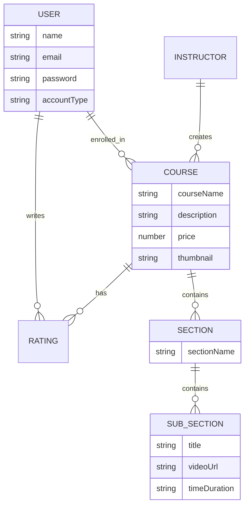

# 🎓 StudyNotion - EdTech Platform

[](https://opensource.org/licenses/MIT)
[](https://github.com/Sahoo999/portfolio-app)
[](https://reactjs.org/)

**StudyNotion** is a fully functional ed-tech platform that enables users to create, consume, and rate educational content. The platform is built using the **MERN stack** (MongoDB, ExpressJS, ReactJS, NodeJS) and aims to provide a seamless interactive learning experience for students while offering instructors a robust platform to showcase their expertise.

### 🔗 Links
- **📺 Explanation Video**: [Watch on YouTube](https://youtu.be/Sv_OFZxmCow)
- **🌍 Live Demo**: [studynotion-by-vivek.vercel.app](https://studynotion-by-vivek.vercel.app/)

---

## 📑 Table of Contents
- [✨ Key Features](#-key-features)
- [💻 Tech Stack](#-tech-stack)
- [🏰 System Architecture](#-system-architecture)
- [🗂️ Database Schema](#-database-schema)
- [🏗️ Architecture Diagram](#-architecture-diagram)
- [📦 Installation & Setup](#-installation--setup)
- [👥 Contributors](#-contributors)

---

## ✨ Key Features

### 🎓 For Students
*   **🏠 Homepage**: Engaging landing page with random background visuals and course highlights.
*   **📚 Course List**: Browse courses with detailed descriptions and ratings.
*   **💡 Wishlist**: Save courses for later.
*   **🛒 Cart & Checkout**: Secure course purchase flow using **Razorpay**.
*   **🎓 Course Content**: Interactive video player and course materials.
*   **👤 User Profile**: Manage account details and view enrolled courses.

### 👩‍🏫 For Instructors
*   **📊 Dashboard**: Real-time overview of course performance and earnings.
*   **📈 Insights**: Detailed analytics on views and clicks.
*   **🛠️ Course Management**: Create, edit, and publish courses.
*   **☁️ Media Management**: Seamless upload for videos and resources via **Cloudinary**.

---

## 💻 Tech Stack

### Frontend 🎨
*    **ReactJS**: Dynamic UI building.
*    **Redux Toolkit**: State management.
*    **Tailwind CSS**: Styling.
*   **Framer Motion**: Smooth animations.
*   **Chart.js**: Data visualization.

### Backend ⚙️
*    **Node.js**: Runtime environment.
*    **Express.js**: Web framework.
*   **JWT**: Secure authentication.
*   **Razorpay**: Payment gateway integration.

### Database & Cloud 🛢️
*    **MongoDB**: NoSQL Database.
*    **Cloudinary**: Media storage.

---

## 🏰 System Architecture

The StudyNotion platform follows a **Client-Server Architecture**:

1.  **Frontend (Client)**: Built with ReactJS, it communicates with the backend via RESTful APIs. It manages consistent state using Redux and creates a responsive UX with Tailwind.
2.  **Backend (Server)**: Powered by Node.js and Express.js, handling business logic, authentication (AuthN/AuthZ), and payment processing.
3.  **Database**: MongoDB stores unstructured data like course details, user profiles, and transaction history.

### 🏗️ Architecture Diagram

```mermaid
graph TD
    Client[Frontend Client (React)]
    LB[API Gateway / Load Balancer]
    Server[Backend Server (Node/Express)]
    DB[(MongoDB Database)]
    Cloud[Cloudinary CDN]
    Payment[Razorpay Gateway]

    Client -->|REST API Requests| LB
    LB --> Server
    Server -->|Query/Update| DB
    Server -->|Store/Retrieve Media| Cloud
    Server -->|Process Payments| Payment
    Server -->|Auth Responses| Client
```

---

## 🗂️ Database Schema

The high-level data model relationships:



---

## 📦 Installation & Setup

1.  **Clone the repository**:
    ```bash
    git clone https://github.com/Sahoo999/portfolio-app.git
    cd portfolio-app
    ```

2.  **Install Frontend Dependencies**:
    ```bash
    cd src
    npm install
    ```

3.  **Install Backend Dependencies** (if applicable in monorepo):
    ```bash
    cd server
    npm install
    ```

4.  **Environment Setup**:
    Create a `.env` file and add your credentials:
    ```env
    MONGO_URL=your_mongodb_url
    JWT_SECRET=your_secret
    CLOUDINARY_URL=your_cloudinary_url
    ```

5.  **Run the Project**:
    ```bash
    npm run dev
    ```

---

## 👥 Contributors

*   **Vivek Panchal** - *Backend & System Architecture*
*   **vivekpanchal** - *52 contributions*

---

<p align="center">
  Made with ❤️ by Debangsu Sahoo
</p>
